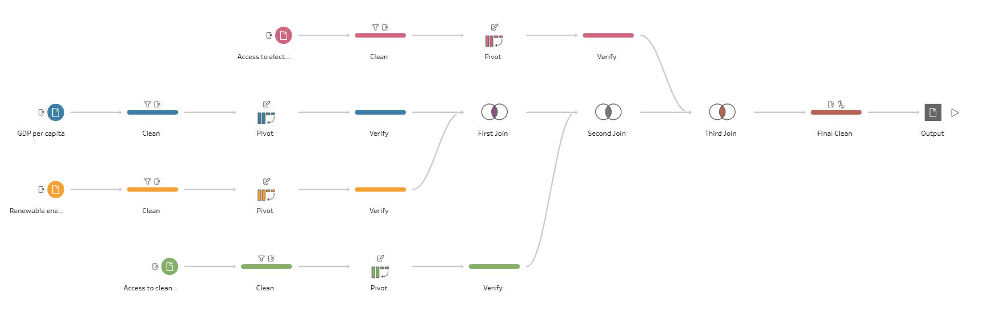

# CSELEC3C-Course-Project
Alright we're starting our DataViz Project. I'll experiment the datasets in this repo, more updates to come.

| Dataset Name | Code |
| :--- | :--- |
| Access to Electricity | EG.ELC.ACCS.ZS |
| Access to clean fuels and technologies for cooking | EG.CFT.ACCS.ZS |
| Renewable energy consumption | EG.FEC.RNEW.ZS |
| GDP per capita | NY.GDP.PCAP.KD

* Nvm I added it back para safe. We can make changes naman if ever should be easy